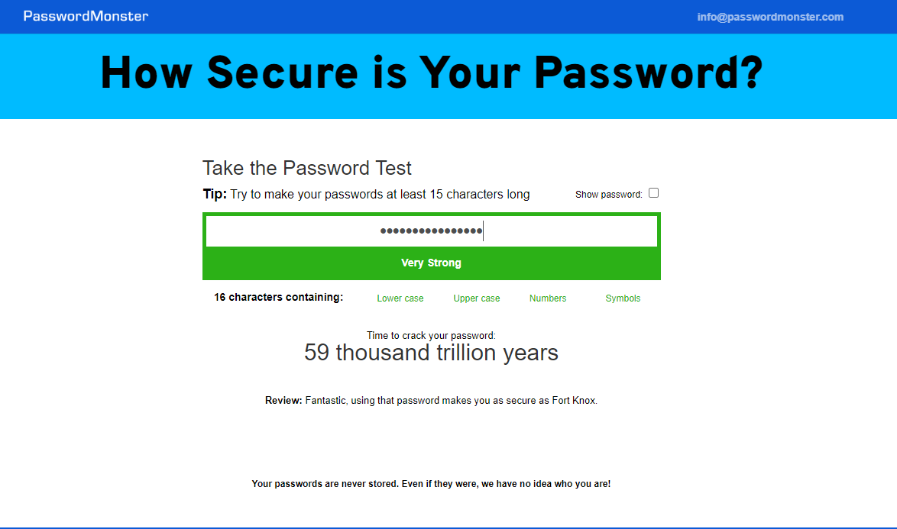

# Password Manager application v1.0
## Introduction:
This project is a Python tkinter practice, as I created a small program that get a three user entry:
#### website name, E-mail/Username and password.
and save all data to a json data file that created when a program start for first time or update the existed one.
## Graphic user interface:

##### We have three labels and for each label there is an entry to hold user data, also we have three buttons each buttons holds a special functionality.
### Search button:
#### Search button functionality is about searching a bout the website name you enter if it is existed a pop-up window will appear with email and password data.
#### If the data file did not exist as the user did not save any data yet, a pop-up will appear as there is no and data file to search throw.
#### Finally, if the user search with and empty of not exited website name, a pop-up window will appear with a message that there is no any data related to the website entry.
### Generate button:
#### This button is very useful as it is generated very strong password that use lower and upper cases characters , numbers and symbols.

##### I checked it throw [www.passwordmonster.com ](), and it showed that the password I generated throw the password manager is a 16 length combining lower, upper cases characters, symbols and numbers as well.
### Add button:
#### Last step after the user add all login data related to the website and when the add button clicked, data will be saved in a json data file.
## Improvement needed:
#### I'm looking to add some improvement in this app later on, and it will be:
* Search for multiple entries for the same website name.
* Encrypt the passwords' data file for more security.
* Add default e-mail or username to make the process much easy and smoother.
* Do some improvement in the GUI like add colors and changing fonts.

